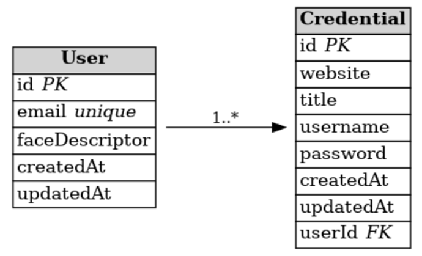

# 🔐 Password Manager with Facial Recognition

[](https://opensource.org/licenses/ISC)
[](https://www.typescriptlang.org/)
[](https://reactjs.org/)
[](https://expressjs.com/)

A secure, modern password management application with cutting-edge facial recognition authentication. This monorepo contains a full-stack solution that combines biometric security with enterprise-grade encryption to protect your sensitive credentials.

## 📋 Table of Contents

- [🚀 Features](#-features)
- [🏗️ Project Structure](#️-project-structure)
- [⚡ Quick Start](#-quick-start)
- [🔧 Development](#-development)
- [🛡️ Security](#️-security)
- [📚 Documentation](#-documentation)
- [🤝 Contributing](#-contributing)
- [📄 License](#-license)

## 🚀 Features

### 🔒 Security First

- **Biometric Authentication**: Advanced facial recognition using [face-api.js](https://github.com/justadudewhohacks/face-api.js)
- **Client-Side Encryption**: AES-256 encryption with PBKDF2 key derivation
- **Zero-Knowledge Architecture**: Passwords never leave your device unencrypted
- **JWT Authentication**: Secure token-based session management
- **HTTPS Enforcement**: SSL/TLS encryption for all communications

### 💻 Modern Technology Stack

- **Frontend**: React 18 + TypeScript + Vite + Tailwind CSS
- **Backend**: Express.js + TypeScript + Prisma ORM
- **Database**: SQLite with migration support
- **Face Recognition**: TensorFlow.js powered face detection and matching
- **Development**: Hot reload, TypeScript compilation, and comprehensive tooling

### 🎯 User Experience

- **Responsive Design**: Works seamlessly across desktop and mobile devices
- **Real-Time Sync**: Instant synchronization between client and server
- **Intuitive Interface**: Clean, modern UI with accessibility features
- **Fast Performance**: Optimized bundle sizes and efficient rendering

## 🏗️ Project Structure

```
pwd-manager/
├── packages/
│   ├── face-pwd-manager-frontend/    # React frontend application
│   │   ├── src/
│   │   ├── public/models/            # Face recognition models
│   │   └── README.md                 # Frontend documentation
│   └── face-pwd-manager-backend/     # Express.js backend API
│       ├── src/
│       ├── prisma/                   # Database schema and migrations
│       └── README.md                 # Backend documentation
├── docs/                             # Comprehensive documentation
│   ├── SECURITY.md                   # Security implementation guide
│   ├── ENCRYPTION.md                 # Encryption technical details
│   ├── FACE_ENCRYPTION.md            # Biometric data protection
│   ├── HTTPS_SETUP.md                # SSL/TLS configuration
│   ├── IMPLEMENTATION.md             # Technical implementation guide
│   └── MONOREPO_WORKFLOW.md          # Development workflow
└── README.md                         # This file
```

## 🗄️ Database Schema

The application uses a simple yet secure database schema designed for optimal performance and security:



### Key Relationships

- **User Model**: Stores user credentials and encrypted face descriptors

  - `id` (PK): Auto-incrementing primary key
  - `email` (unique): User identification and login
  - `faceDescriptor`: Encrypted 128-dimensional face template
  - `createdAt/updatedAt`: Audit timestamps

- **Credential Model**: Stores encrypted user passwords and login information
  - `id` (PK): Auto-incrementing primary key
  - `website`: Target website/service URL
  - `title`: Optional display name for the credential
  - `username`: Encrypted username/email for the service
  - `password`: Encrypted password using AES-256 + PBKDF2
  - `userId` (FK): Links to the owning user
  - `createdAt/updatedAt`: Audit timestamps

### Security Design

- **One-to-Many Relationship**: Each user can have multiple credentials
- **Encrypted Storage**: All sensitive data (passwords, usernames, face descriptors) are encrypted before storage
- **Zero-Knowledge**: Server cannot decrypt user data without user-specific keys
- **Audit Trail**: All records include creation and modification timestamps

## ⚡ Quick Start

### Prerequisites

- Node.js 18+ and npm
- Modern web browser with webcam support
- Git for version control

### Installation

1. **Clone and setup the monorepo:**

   ```bash
   git clone <repository-url>
   cd pwd-manager
   npm run install:all
   ```

2. **Start development environment:**

   ```bash
   npm run dev
   ```

   This starts both frontend (http://localhost:5173) and backend (http://localhost:3000) servers.

3. **Build for production:**
   ```bash
   npm run build
   ```

### Available Scripts

| Command              | Description                                 |
| -------------------- | ------------------------------------------- |
| `npm run dev`        | Start development servers for both packages |
| `npm run build`      | Build both packages for production          |
| `npm run start`      | Start production servers                    |
| `npm run lint`       | Lint all TypeScript files                   |
| `npm run format`     | Format code with Prettier                   |
| `npm run type-check` | Run TypeScript type checking                |
| `npm run clean`      | Clean build artifacts                       |

## 🔧 Development

### Monorepo Workflow

This project uses npm workspaces for efficient package management. See [MONOREPO_WORKFLOW.md](./docs/MONOREPO_WORKFLOW.md) for detailed development guidelines.

### Individual Package Development

- **Frontend**: `cd packages/face-pwd-manager-frontend && npm run dev`
- **Backend**: `cd packages/face-pwd-manager-backend && npm run watch`

### Database Management

```bash
# Setup database and run migrations
cd packages/face-pwd-manager-backend
npx prisma migrate dev

# Open Prisma Studio for database inspection
npx prisma studio
```

## 🛡️ Security

Security is our top priority. This application implements multiple layers of protection:

- **🔐 End-to-End Encryption**: See [ENCRYPTION.md](./docs/ENCRYPTION.md)
- **👤 Biometric Security**: See [FACE_ENCRYPTION.md](./docs/FACE_ENCRYPTION.md)
- **🌐 Network Security**: See [HTTPS_SETUP.md](./docs/HTTPS_SETUP.md)
- **🛡️ Comprehensive Security**: See [SECURITY.md](./docs/SECURITY.md)

### Security Features Summary

- AES-256-GCM encryption for password storage
- PBKDF2 key derivation with 100,000 iterations
- Secure face descriptor storage with biometric template protection
- JWT tokens with secure HttpOnly cookies
- CORS protection and security headers
- Input validation and sanitization

## 📚 Documentation

Comprehensive documentation is available in the `/docs` directory:

| Document                                                  | Description                                |
| --------------------------------------------------------- | ------------------------------------------ |
| [📖 Implementation Guide](./docs/IMPLEMENTATION.md)       | Complete technical implementation overview |
| [🔒 Security Documentation](./docs/SECURITY.md)           | Security architecture and best practices   |
| [🔐 Encryption Details](./docs/ENCRYPTION.md)             | Cryptographic implementation specifics     |
| [👤 Face Recognition Security](./docs/FACE_ENCRYPTION.md) | Biometric data protection methods          |
| [🌐 HTTPS Setup](./docs/HTTPS_SETUP.md)                   | SSL/TLS configuration guide                |
| [⚙️ Monorepo Workflow](./docs/MONOREPO_WORKFLOW.md)       | Development and deployment processes       |

### Package Documentation

- [Frontend README](./packages/face-pwd-manager-frontend/README.md) - React application details
- [Backend README](./packages/face-pwd-manager-backend/README.md) - API server documentation

## 🤝 Contributing

We welcome contributions! Please read our guidelines:

1. **Fork the repository**
2. **Create a feature branch**: `git checkout -b feature/amazing-feature`
3. **Follow our coding standards**: Run `npm run lint` and `npm run format`
4. **Write tests**: Ensure your code is well-tested
5. **Commit your changes**: `git commit -m 'Add amazing feature'`
6. **Push to the branch**: `git push origin feature/amazing-feature`
7. **Open a Pull Request**

### Development Guidelines

- Follow TypeScript best practices
- Write meaningful commit messages
- Add documentation for new features
- Ensure security considerations are addressed

## 📄 License

This project is licensed under the ISC License - see the [LICENSE](LICENSE) file for details.

---

**⚠️ Security Notice**: This application handles sensitive credential data. Always use HTTPS in production and follow security best practices outlined in our documentation.

**💡 Need Help?** Check our comprehensive documentation or open an issue for support.
